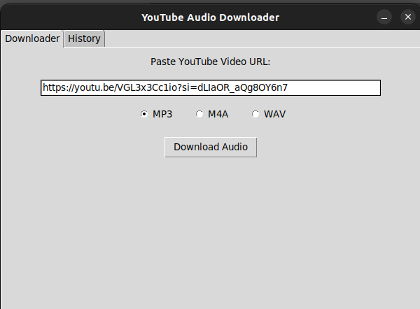
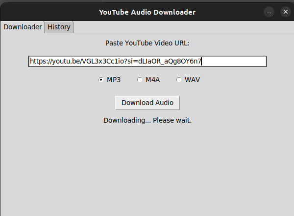
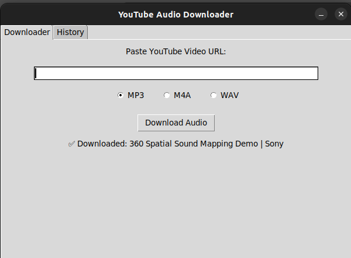
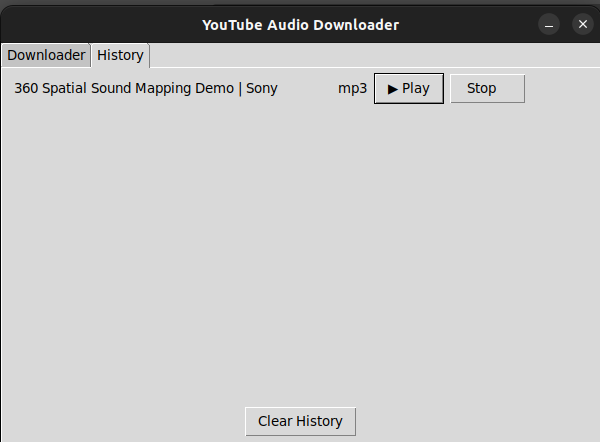

# 🎵 Audio Downloader GUI Tool

A simple, clean desktop utility to **download audio from YouTube videos** with one click.  
Built using Python and Tkinter, with platform compatibility for **Windows, macOS, and Linux**.

---

## 📦 Features

- ✅ Download audio from YouTube links
- ✅ Choose format: `.mp3`, `.wav`, `.m4a`
- ✅ Automatically stores and displays **download history**
- ✅ Embedded **Play & Pause** buttons for each downloaded track
- ✅ Option to **clear history** at any time
- ✅ GUI built with `tkinter`, styled with minimal and clean design
- ✅ Cross-platform installers: `.exe`, `.dmg`, `.AppImage`

---

## 🖼️ Preview

>   

>  

>  

>  

*Lightweight GUI with essential controls. Play audio directly from history tab.*

---

## 💻 Installation (OS-wise)

### 🪟 Windows

1. Navigate to [`Windows_Installer/`](./Windows_Installer/)
2. Download `YTAudio_Downloader.exe`
3. Double-click to launch  
   > 💡 If Windows blocks it, click:  
   `More Info → Run Anyway`


### 🐧 Linux

1. Navigate to [`Linux_Installer/`](./Linux_Installer/)
2. Download `YTAudio_Downloader.AppImage`
3. Run the following in terminal:
   ```bash
   chmod +x AudioDownloader.AppImage
   ./AudioDownloader.AppImage

---

### 🍎 macOS

1. Clone the repository from https://github.com/shreekantsinsinwar/YTAudio_Downloader.git
2. Install the requirements from requirements.txt
3. run the following command to get an executable file located in dist folder
```bash
brew install pyinstaller
pyinstaller --noconsole --onefile --windowed main.py
```
4. Use the this main file to directly launch YTAudio_Downloader


---